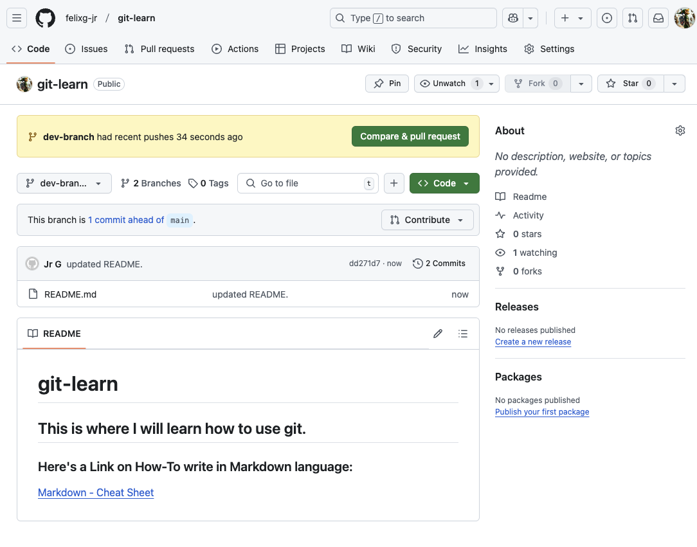

# Table of Contents
- [Part One - Creating a New Repository & Cloning it Locally](#creating-a-new-repository-and-cloning-it-locally)
- [Part Two - Creating a New Branch & Commiting Changes](#creating-a-new-branch-and-commiting-changes)

# Creating a New Repository and Cloning it Locally

1. Log into [GitHub](https://www.github.com).
2. Create a new repo by clicking on 'New'.
> 
3. Fill in the mandatory fields, choose whether you want your repository to be public or private, and check the 'Add a READEME file' box.
> 
4. Click on 'Create repository'.
5. Click on 'Code' > Copy the web URL of your repository.
> 
6. Open VSCode > Click on the Explorer button > Click on 'Clone Repository'.
> 
7. Copy/paste your repository's web UR > Hit 'Enter'.
> 
8. Choose where you would like to save your cloned repository on your local machine > Click on 'Select as Repository Destination'.
> 
9. Click on 'Open' or 'Open in New Window'.
> 
10. Now you have successfully created a new repository and cloned it to your local machine! Now the fun starts! 🤩
> 

# Creating a New Branch and Commiting Changes

1. Click on 'main' (this is your main branch) on the bottom left corner of VSCode > Type in the name of your new branch (call if whatever you'd like!) > Click on 'Create new branch...'.
> 
2. Then click on the cloud icon on the bottom left corner to sync your local branch to your remote repository.
> 
3. Now your new branch should be available in your GitHub repository! 
> 
> 
4. Now you can make any changes without affecting your 'main' branch. In this example I'm editing the existing 'README.md' file.
> 
5. To then commit/sync my changes to my remote repository... > Click on the 'Source Control' icon > Click on the plus sign next to file > Enter in a comment of the change your are about to commit > Click on '✓ Commit'.
> 
>> > 
6. Click on 'Sync Changes'.
> 
7. Now go back to your GitHub repository (may need to refresh page), and you'll see your new changes!😃
> 

## Other Resources:
### Here's a Link on How-To write in Markdown language:

[Markdown - Cheat Sheet](https://www.markdownguide.org/cheat-sheet/)